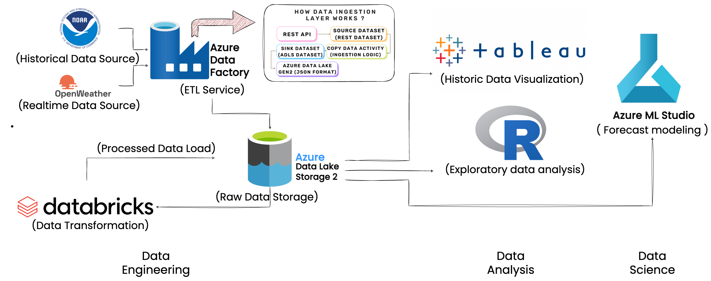

# Weather Data Intelligence
### Comprehensive Data Engineering, In-Depth Analysis of Historical Data, and Forecasting on Real-Time Weather Data.
## Overview
This project builds an end-to-end pipeline to ingest, preprocess, analyze, and forecast weather data using Azure Data Factory, Azure Data Lake Storage (ADLS), Databricks, and Azure Machine Learning Studio. It also features a dynamic Tableau dashboard for visualization.

## Workflow
#### 1. Data Sources
• OpenWeather API:
  - Current Weather API: [OpenWeather API - Current](https://openweathermap.org/current)
  - Data Endpoint:
    - `https://api.openweathermap.org/data/2.5/onecall?lat=33.44&lon=-94.04&appid={API key}`

• Global Historical Climatology Data:
  - Source: [NCEI Historical Data](https://www.ncei.noaa.gov/access/search/data-search/global-historical-climatology-network-hourly?bbox=40.963,-74.257,40.463,-73.757)

      - Stored in Kaggle for your easy access: [NCEI Historical Data](https://www.kaggle.com/datasets/nikhilnakum/raw-weather-data-newyork-city-100-features)

#### 2. Data Ingestion: Azure Data Factory
1. Setup Data Source and Sink:
  - Source: APIs (OpenWeather), Historical CSVs (NCEI).
  - Sink: Azure Data Lake Storage (ADLS).
2. Steps:
  - Create Copy Data Activity in Azure Data Factory.
  - Configure the source (APIs/CSV) and sink (ADLS).
  - Trigger pipelines to store raw data in ADLS.

#### 3. Data Preprocessing: Azure Databricks
1. Use Databricks notebooks to clean and transform the data:
  - API Data Transformation: `Api-data transformation.ipynb`
  - Historical Data Preprocessing: `Historical Preprocess.ipynb`
2. Steps:
  - Mount ADLS in Databricks.
  - Clean, preprocess, and transform the raw data.
  - Save the processed data back into ADLS in Parquet format.

#### 4. Data Visualization: Tableau Dashboard
- Store cleaned data in ADLS using Blob Storage mechanisms.
- Connect Tableau to ADLS for visualization.
- Dashboard Link: [Weather Dashboard](https://public.tableau.com/app/profile/yash.gajera/viz/Final_Dashboard_17334287772920/Dashboard)

#### 5. Exploratory Data Analysis (EDA): Azure Machine Learning Studio
1. Conduct EDA using R and ggplot2 in `EDA.ipynb`.
2. Visualize temperature trends, correlations, and seasonal patterns.

#### 6. Forecasting Models: Azure Machine Learning Studio
Developed two predictive models:
1. SARIMA Model: `Forecast.ipynb`
2. LSTM Model: `LSTM_Model.ipynb`

## Tools & Technologies
- Cloud Platform: Azure
- Storage: Azure Data Lake Storage
- Data Pipelines: Azure Data Factory
- Processing: Azure Databricks
- EDA & Modeling: Azure Machine Learning Studio
- Visualization: Tableau

## Steps to Run
1. Set up Azure Data Factory for data ingestion (Source to ADLS).
2. Preprocess data using Databricks notebooks.
3. Store cleaned data back to ADLS.
4. Build dashboards with Tableau using Blob Storage.
5. Perform EDA and forecasting in Azure ML Studio using provided notebooks.

## Data Sources & Links
- Global Historical Climatology: NCEI Historical Data
- OpenWeather API: [OpenWeather API](https://openweathermap.org/current)
- Historical Raw Data: [Google Drive Link](Replace with your GDrive link)

## Contact
**Nikhilbhai Nakum**
-	Email: nakum.nikhil33@gmail.com
 
